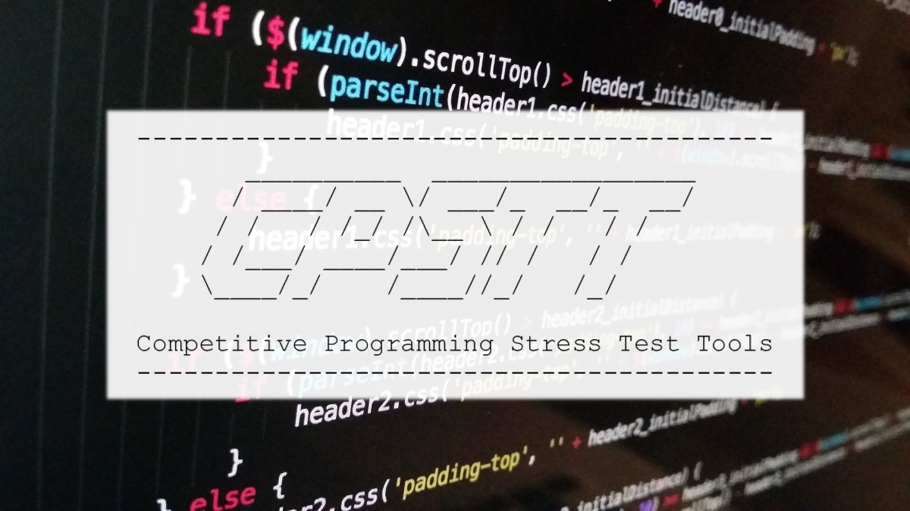

[](LICENSE)  [](https://atcoder.jp/users/xryuseix) [](https://codeforces.com/profile/xryuseix)

# Competitive Programming Stress Test Tools

競技プログラミング用 ストレステストツール

<div align="center">
  
</div>

## このプログラムの役割

1. Wrong Answer のプログラムに対して，それより実行時間がかかる愚直プログラムと比較することで WA となるテストケースを探し出す
2. 最大コーナーケースに対して，実行時間以内に計算ができるかテストをする

## インストール

```sh
git clone https://github.com/xryuseix/CPSTT
cd CPSTT
cargo run
```

## How to use

開発中です...
