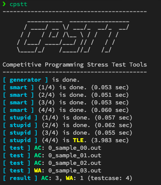

[](LICENSE)  [](https://atcoder.jp/users/xryuseix) [](https://codeforces.com/profile/xryuseix)

# Competitive Programming Stress Test Tools

競技プログラミング用 ストレステストツール

<div align="center">
  
</div>

## このプログラムの役割

1.  のプログラムに対して，それより実行時間がかかるが確実に  できる愚直プログラムと比較することで，  となるテストケースを探し出す
2. 最大コーナーケースに対して，実行時間以内に  ができるかテストをする

## デモンストレーション

<div align="center">
  
</div>

## インストール

```sh
git clone https://github.com/xryuseix/CPSTT
cd CPSTT
cargo install --path .
cd test # または以下に記す設定を行う(推奨)
cpstt # 実行
```

## 必要なディレクトリ構成

[test ディレクトリ](https://github.com/xryuseix/CPSTT/tree/master/test)を参考に，以下のファイル/ディレクトリを作成してください．

```sh
/path/to/YourCodingDirectory
|--cpstt_out/
| |--smart/
| |--stupid/
|--generator.cpp
|--settings.toml
|--smart.cpp
|--stupid.cpp
|--testcase/
```

## 各入力ファイルの説明

### generator.cpp

- テストケースを作成するプログラム
- `ofs`に出力した内容がそのままテストケースとなる．`init`関数を除いて，[icpc-jag/rime](https://github.com/icpc-jag/rime)と同じように記述可能
- 以下のように記述すれば良い

```cpp
#include <fstream>
#include <iostream>
using namespace std;

string root_path = "";

void init(int argc, char *argv[]) {
    srand((unsigned)(time(NULL)));
    for (int i = 1; i < argc; i++) {
        root_path += std::string(argv[i]);
    }
}

// aとbをファイルストリームに出力する
// ファイル名は prefix_num.in (ex: 00_sample_00.in)
void output(int a, int b, const string &prefix, const int num) {
    char name[100];
    sprintf(name, "%s/testcase/%s_%02d.in", root_path.c_str(), prefix.c_str(),
            num);
    ofstream ofs(name);
    /* ここから書き換える */
    ofs << a << " " << b << endl;
    /* ここまで */
    ofs.close();
}

int main(int argc, char *argv[]) {
    init(argc, argv);
    /* ここから書き換える */
    output(0, 0, "0_sample", 0);
    output(0, 1, "0_sample", 1);
    output(1, 0, "0_sample", 2);
    output(1, 1, "0_sample", 3);
    /* ここまで */
}
```

[参考プログラム](https://github.com/xryuseix/CPSTT/blob/master/test/generator.cpp)

### smart.cpp

- 競技プログラミングの問題を解くプログラムのここに記述する
- stupid.cpp と入れ替えても良いが，名前の通り効率の**良い**プログラムを記載することを勧める

[参考プログラム](https://github.com/xryuseix/CPSTT/blob/master/test/smart.cpp)

### stupid.cpp

- 競技プログラミングの問題を解くプログラムのここに記述する
- smart.cpp と入れ替えても良いが，名前の通り効率の**悪い**プログラムを記載することを勧める

[参考プログラム](https://github.com/xryuseix/CPSTT/blob/master/test/stupid.cpp)

### settings.toml

- 本プログラムの設定ファイル
- 使い方はコメントの通り

```toml
[execution]
# ユーザプログラム実行結果の最大表示文字数
max_output_len = 200
# ユーザプログラム実行結果の最大表示行数
max_output_line = 4

[logging]
# ユーザプログラム実行結果の表示有無
dump_exe_result = false
```

[参考ファイル](https://github.com/xryuseix/CPSTT/blob/master/test/settings.toml)

## 各入力ディレクトリの説明

### cpstt_out/

smart.cpp と stupid.cpp が出力した実行結果を保存する

### cpstt_out/smart/

smart.cpp が出力した実行結果を保存する

### cpstt_out/stupid/

stupid.cpp が出力した実行結果を保存する

### testcase/

generator.cpp の出力先 (テストケースの保存先)

## 注意

stupid.cpp や smart.cpp が TLE した場合にプログラム実行打ち切りする機能はありません．地球が爆発するようなプログラムは書かないようにしましょう．
